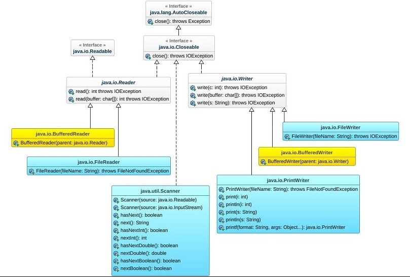

# Java
## Classi utili
### import java.util.Random
```Java
Random random = new Random();
int var = random.nextInt(10)+3;
//estrae un numero da 3 a 10, compresi.
```
### import java.util.Scanner
```Java
Scanner keyboard = new Scanner(System.in);
String line = keyboard.nextLine(); //nextInt() nextDouble()...
keyboard.close();
```
## Enumerazioni
```Java
public enum NomeEnum{
    VALUE1,
    VALUE2
}
//possiamo stampare la posizione dei vari valori con: NomeEnum.VALUE1.ordinal();
```
## Dichiarazione classi
```Java
public class NomeClasse{
    private int var1;
    private int var2;
    private int var3;
    private static final int[] arr1= {1,2,3,4};

    public NomeClasse(int var1, int var2, int var3){
        this.var1 = var1;
        this.var2 = var2;
        this.var3 = var3;
    }
    public NomeClasse(int var1, int var2){
        this(var1, var2, 554);
    }
    public NomeClasse(int var1){
        this(var1, 105);
    }

    public boolean equals(Object other){
        //serve per vedere se 2 oggetti possiedono gli stessi valori.
    }

    public int compare(Object other){
        //server per vedere se .this è prima, dopo o allo stesso livello di .other.
    }
}
```
## Estensione classi
Quando si estende una classe, la sottoclasse deriva tutti i metodi e i campi. Non eredità il costruttore, ma può richiamarlo e passargli i parametri ricevuti. Essendo i campi private, e dovendo rispettare incapsulamento e polimorfismo, è bene dichiarare nella superclasse un metodo pubic, per ottenerne il valore.<br>Se si estende una classe astratta, sarà necessario definire i metodi che dichiara.
```Java
public abstract class Parent{
    private int val1;
    public Parent(int val1){
        this.val1 = val1;
    }

    public int getValue(){
        return this.val1;
    }

    public boolean equals(Object other){
        return other instanceof Parent &&
            this.val1 == ((Parent)other).val1;
    }

    public abstract String toString();
}

public class Subclass extends Parent{
    public Subclass(int val1){
        super(val1);
    }

    public String toString(){
        return "The value is: "+ getValue();
    }
}
```
## Implementazione interfacce
Quando si implementa un'interfaccia, bisogna definire i metodi che essa dichiara. L'interfaccia è quindi una promessa, che le classi che la implementano, definiscano qui metodi. Viene utilizzata per una questione di organizzazione e gerarchia. Una classe può estendere solo un'altra classe, ma può implementare tutte le interfacce che vuole.
```Java
public interface NomeInterfaccia{
    public int getValue();
}

public class NomeClasse{
    private final int value = 3;

    public int getValue(){
        return this.value;
    }
}
```

## Classi generiche
```Java
public class NomeClasse<F,S>{
    private final F first;
    private final S second;

    public NomeClasse(F first, S second){
        this.first = first;
        this.second = second;
    }
}

//nel Main
NomeClasse<String,Integer> pair = new NomeClasse<String,Integer>("Ciao", 1);
```

## Interfaccia Comparable
Si tratta di un interfaccia, che dichiare il metodo __compareTo()__, e che può essere implementata nelle classi comparabili, in modo da poter utilizzare particolari metodi utili, come __sort()__ di __Util__.<br>Se si volesse ordinare un insieme di interi, non è possibile farlo mediante i tipi primitivi, per questo esistono le classi __Wrapper__.
```Java
//il metodo valueOf() può essere utilizzato per tutti i tipi di riferimento (Char, Double, Boolean...)
Integer val1 = Integer.valueOf(4);
//grazie al metodo valueOf() si esegue il boxing manuale, ma funziona anche un'inizializzazione classica, detta boxing automatico
Integer val2 = 4;
//per passare da Integer a int, possiamo eseguire l'umboxing con il metodo intValue(), ma possiamo usare anche una classica assegnazione
int val3 = val1;
```
## Interfaccia Iterable
Questa interfaccia permette di rendere una collezione iterabile nei suoi elementi, e implementa il singolo metodo __iterator()__, che restituisce un'interfaccia della classe __Iterator__:
```Java
//la classe ClasseIterabile implementa "Iterable", e contiene gli elementi di tipo "Elemento".
ClasseIterabile collezione = new ClasseIterabile();
Iterator<Elemento> it = collezione.iterator();
while(it.hasNext()){
    Elemento e = it.next();
    System.out.println(e);
}
```
Grazie ad un foreach, possiamo eseguire questo codice, semplificandone la scrittura:
```Java
ClasseIterabile collezione = new ClasseIterabile();
for(Elemento e: collezione){
    System.out.println(e);
}
```
Ovviamente è necessario implementare il metodo "iterator()" dentro la __ClasseIterabile__:
```Java
import java.util.Iterator;
public class ClasseIterabile implements Iterable<Elemento>{
    private final SortedSet<Elemento> collezione = new TreeSet<>();
    
    public Iterator<Elemento> iterator(){
        return collezione.iterator();
    }
}
```
Nell'esempio, l'oggetto "collezione" è un __Set__, quindi una classe con dei propri metodi. Nel caso in cui ci fosse stato un array, sarebbe stato necessario utilizzare una __classe anonima__ nel metodo iterator(), implementando i metodi next() ed hasNext():
```Java
public Iterator<Elemento> iterator(){
        return new Iterator<Elemento>(){
            private int cursor = 0;
            public boolean hasNext(){
                return cursor < n_elementi;
            }
            public Elemento next(){
                return collezione[cursor++];
            }
        };
    }
```
## Array, Liste, Code

### Interfaccia Collection
```Java
// aggiunge uno o più elementi, e restituisce true, se almeno uno viene aggiunto con successo.
public boolean add(E element);
public boolean addAll(Collection<E> other);
// controlla se sono presenti uno o più oggetti, e restituisce true, se sono tutti presenti. 
public boolean contains(Object element);
public boolean containsAll(Collection<?> other);
// rimuove uno o più elementi, e restituisce true, se almeno uno viene rimosso con successo.
public boolean remove(Object element);
public boolean removeAll(Collection<?> other);
// rimuove gli elementi non presenti, e restituisce true, se almeno uno viene rimosso.
public boolean retainAll(Collection<?> other);
// restituisce true, se la collezione è vuota.
public boolean isEmpty();
// restituisce la dimensione della collezione.
public int size();
```
### Interfaccia List
```Java
// aggiunge un elemento in fondo alla lista, e ritorna sepre true.
public boolean add(E element);
// aggiunge un elemento all'index corrisponente, slittando quelli a destra di 1 posizione.
public void add(int index, E element);
// ritorna l'elemento all'index corrispondente.
public E get(int index);
// ritorna l'index dell'elemento corrispondente, -1 se non è presente.
public int indexOf(Object element);
// rimuove la prima occorrenza, dell'elemento specificato, e ritorna true se viene rimosso.
public boolean remove(Object element);
// rimuove e restituisce l'elemento all'index corrispondente, slittando quelli a destra di 1 posizione.
public E remove(int index);
// sostituisce con il nuovo elemento, all'index specificato, e restituisce il vecchio elemento
public E set(int index, E element);
```
### Classi LinkedList e ArreyList
```Java
// creano rispettivamente delle liste, con gli elementi della collezione parent
LinkedList arr1 = new LinkedList(Collection<? extends E> parent);
ArrayList arr1 = new ArrayList(Collection<? extends E> parent);
```
LinkedList differisce da ArrayList per il modo in cui è implementato, infatti ogni elemento possiede dei puntatori che puntano all'elemento precedente e successivo. Quando si va ad aggiungere o rimuovere un elemento ad una certa posizione, verranno modificati questi puntatori, mentre nell'ArrayList tutti gli elementi successivi, dovranno slittare di una posizione.

### Interfaccia Queue e classe PriorityQueue
```Java
// rimuovono e ritornano la testa della coda, ma se è vuota: poll() restituisce null, remove() lancia un'eccezione.
public E poll(); 
public E remove() throws java.util.NoSuchElementException;
// ritornano la testa della coda, ma se è vuota: peek() restituisce null, element() lancia un'eccezione.
public E peek(); 
public E element() throws java.util.NoSuchElementException;x
// aggiungono un elemento nel fondo della coda, ma se è piena:
public boolean offer(E element); // ritorna false.
public boolean add(E element) throws java.util.IllegalStateException; // lancia un'eccezione, ma ritorna sempre true.
```
```Java
// Costruttori della classe PriorityQueue:
Queue q1 = new PriorityQueue();
Queue q2 = new PriorityQueue(Collection<? extends E> parent);
```
### Interfaccia Map<K,V> e classe HashMap
```Java
// restituisce true, se la mappa contiene la key o il value.
public boolean containsKey(Object key);
public boolean containsValue(Object value);
// restituisce il value corrispondente al key specificato.
public V get(Object key);
// restituisce true se la mappa è vuota.
public boolean isEmpty();
// restituisce un Set contenente le key.
public Set<K> keySet();
// setta il value nella chiave, e se è già presente lo rimpiazza, restituendo il vecchio valore, altrimenti null.
public V put(K key, V value);
public V putIfAbsent(K key, V value);
// rimuove il valore, e lo restituisce. Se non è presente restituisce null.
public V remove(Object key;)
// restituisce la dimensione.
public int size();
```
```Java
// Costruttori della classe HashMap:
Map m1 = new HashMap();
Map m2 = new HashMap(Map<? extends K, ? extends V> parent);
```
## Classi interne
Possiamo definire all'interno di una classe, un'altra classe, che viene definita __classe interna__. All'interno della classe che la contiene, la classe interna verrà chiamata con il suo nome, ma all'esterno, verrà chiamata con _NomeClasseEsterna.NomeClasseInterna_.<br>Vengono utilizzate per un'implementazione aggiuntiva alla classe esterna, e quindi solitamente sono definite private (ma non per forza).
```Java
public class Main{
    public static void main(String []args){
        NomeClasse c1 = new NomeClasse();
    }

    public static class NomeClasse{
        //va definita static, perchè è definita all'interno del main.
        //in altri casi, se non è static, la classe può accedere ai campi esterni.
    }
}
```

## Eccezioni
Le eccezioni possono venir definite e lanciate, inserendole nel codice. Se la classe dell'eccezione estende __RuntimeException__ o __Error__ (e le sottoclassi), viene detta _non controllata_, mentre se estende __Exception__, è detta _controllata_. Quando l'eccezione è controllata, è necessario dichiararla nel metodo che la lancia, oppure gestirla. In caso contrario si otengono degli errori in compilazione.
```Java
public NomeClasse throws NomeEccezione1{
    //Viene dichiarata nel costruttore con throws, perchè estende Exception.
    if(...){
        throw new NomeEccezione1("Messaggio di errore");
    }//...
}
public class Main{
    public static void main(String []args) throws NomeEccezione1{
        NomeClasse o1 = new NomeClasse();
    }
}
```
Se l'eccezione specificata non è tra quelle definite da Java, dobbiamo definirne la classe:
```Java
public class NomeEccezione2 extends RuntimeException{
    public NomeEccezione2(String messaggio){
        super(messaggio);
    }
}
```
L'eccezione distrugge tutto quello che viene prima di essa, andando a terminare il programma, quindi è necessario gestirle:
```Java
NomeClasse c1;
try{
    c1 = new NomeClasse("parametri");
}catch(NomeEccezione1 e){
    System.out.println("Errore!");
}catch(NomeEccezione2 e){
    System.out.println("Errore!");
}catch(RuntimeException e){
    System.out.println("Errore!");
}finally{
    System.out.println("Fine!");
}
```
Grazie alla gestione delle eccezioni in modalità __with resource__, è possibile chiudere automaticamente oggetti come uno scanner:
```Java
try(
    Scanner keyboard = new Scanner(System.in)
){
    ...
}catch(NomeEccezione e){...}
```
## Scrittura e lettura file
Grazie alla modalità "with resource", è possibile chiudere automaticamente anche le istanze delle classi __Reader__ e __Writer__, che permettono di scrivere e leggere da un file, carattere per carattere. Visto che nel farlo bisogna accedere al disco ad ogni carattere, è possibile utilizzare le classi __Buffered__ che prelevano dal disco un byte di carattere ogni volta:
```Java
try(
    Reader reader = new BufferedReader(new FileReader("nomefile1.txt")) ;
    Writer writer = new BufferedWriter(new FileWriter("nomefile2.txt"));
){
    int c;
    while((c = reader.read()) != -1){
        //System.out.printf("%d - %c\n", c, c); //nel caso si voglia stampare.
        //writer.write(Character.toUpperCase(c)) // permette di stampare i caratteri in maiuscolo.
        writer.write(c);
    }
}catch(FileNotFoundException e){
    System.out.println("Il file non esiste!");
}catch(IOException e){
    System.out.println("Errore di I/O");
}
```
Oltre a leggere file di testo, è possibile leggere i file binari, grazie alle classi __Input/OutputStream__ che leggono un byte alla volta:
```Java
try(
    InputStream reader = new BufferedReader(new FileInputStream("nomefile1.txt")) ;
    OutputStream writer = new BufferedWriter(new FileOutputStream("nomefile2.txt"));
)...
```
Gerarchie:

## 